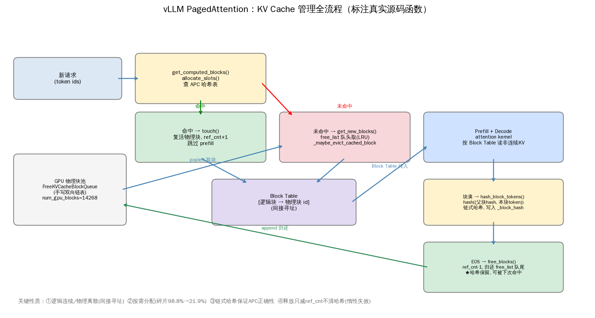
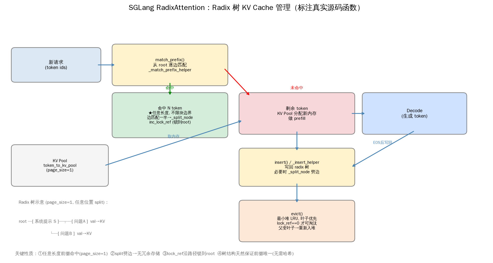
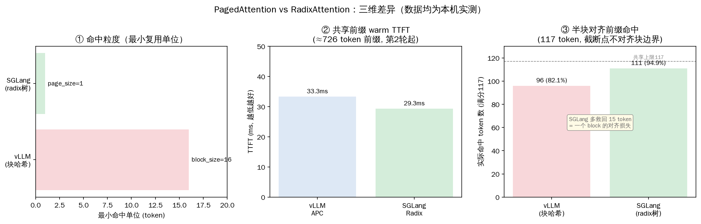

# KV Cache 架构对比图

> M2 收尾。把前两天源码精读（[[vLLM源码精读-PagedAttention内存管理-06-14]] + [[SGLang源码精读-RadixAttention-06-14]]）画成 PPT 可用的架构图。三张图：每个箭头对应真实源码函数，差异图数字全部来自本机实测。
>
> 绘图脚本 [draw_arch.py](../draw_arch.py)（基础环境 matplotlib，中文用 WenQuanYi Zen Hei 字体）。

---

## 图 1：vLLM PagedAttention 全流程



箭头 → 源码函数对应（均来自 05-06 笔记）：

| 流程框 | 真实源码函数 | 文件:行 |
|---|---|---|
| 查 APC 哈希表 | `get_computed_blocks()` → `allocate_slots()` | kv_cache_manager.py:194/236 |
| 命中复活块 | `touch()`（free_list.remove + ref_cnt+1） | block_pool.py:402 |
| 未命中取新块 | `get_new_blocks()` → `_maybe_evict_cached_block()` | block_pool.py:333/365 |
| 物理块池 | `FreeKVCacheBlockQueue`（手写双向链表） | kv_cache_utils.py:164 |
| 满块算哈希 | `hash_block_tokens()`（链式） | kv_cache_utils.py:541 |
| EOS 释放 | `free_blocks()`（ref_cnt-1，哈希保留） | block_pool.py:419 |

---

## 图 2：SGLang RadixAttention 全流程



箭头 → 源码函数对应（均来自 05-07 笔记）：

| 流程框 | 真实源码函数 | 文件:行 |
|---|---|---|
| 逐边匹配 | `match_prefix()` → `_match_prefix_helper()` | radix_cache.py:337/622 |
| 边匹配一半→劈开 | `_split_node()` | radix_cache.py:648 |
| 命中锁路径 | `inc_lock_ref()`（沿路径锁到 root） | radix_cache.py:566 |
| 写回树 | `insert()` → `_insert_helper()` | radix_cache.py:397/678 |
| LRU 淘汰 | `evict()`（最小堆，叶子优先） | radix_cache.py:537 |

---

## 图 3：三维差异（数据全部本机实测）



| 维度 | vLLM | SGLang | 数据来源 |
|---|---|---|---|
| ① 命中粒度 | block_size=16 | page_size=1 | 源码 + /metrics 实测 |
| ② 共享前缀 warm TTFT | 33.3ms | 29.3ms | [[vLLM-PrefixCaching实测-06-13]] / [[RadixAttention多轮对话实验-06-13]] |
| ③ 半块前缀命中(117token) | 96 (82.1%) | 111 (94.9%) | [[RadixAttention多轮对话实验-06-13]] |

> 第③图最关键：同样 117 token 的共享前缀，截断点不对齐块边界时，**SGLang 比 vLLM 多救回 15 token = 正好一个 block 的对齐损失**。这是两框架缓存粒度差异最直接的可视化。

---

## 验收对照（计划步骤4标准）

- [x] **每个箭头都能指出源码函数名** → 见上面三张对应表，全部来自 05-06/05-07 精读笔记
- [x] **差异图数字都是自己跑的** → 33.3/29.3ms、96/111 token 均本机实测，非占位
- [x] **可直接用于 PPT** → 13×7 横版、中文标注（WenQuanYi 字体）、150 dpi

> 修正了计划脚本里的两处占位数据：原稿 SGLang TTFT 写 0、半块前缀写 18token，均替换为真实实测（29.3ms、117token 命中 96 vs 111）。

---

## 今日产出

- [x] assets/pagedattention_arch.png（6 个真实函数标注）
- [x] assets/radixattention_arch.png（5 个真实函数标注）
- [x] assets/kvcache_diff.png（三维差异，全实测数据）
- [x] draw_arch.py（一个脚本生成三图，中文字体已配好）

## 复现

```bash
/home/guoda/python/bin/python3 draw_arch.py   # 基础环境装了 matplotlib
```
