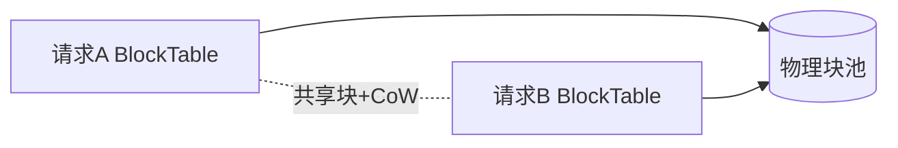

## 📅 今日任务

- [ ] 画 PagedAttention 架构示意图
- [ ] 画 RadixAttention 架构示意图
- [ ] 标注两者关键差异点（内存管理、前缀共享、调度策略）
- [ ] 输出适用于 PPT 的高清架构对比图

**预期产出：** 架构对比图

## 🎯 本周阶段 & 目标

| 项目 | 内容 |
|------|------|
| 阶段 | Week 3：架构深入 — KV Cache 管理 |
| 目标 | 搞懂 PagedAttention vs RadixAttention 设计哲学 |
| 里程碑 | M2: 架构深入 |
| 距分享还有 | **58 天** |

## 📝 学习记录

### PagedAttention 核心思想

> （在此记录关键要点）

### RadixAttention 核心思想

> （在此记录关键要点）

### 对比分析

| 维度 | PagedAttention | RadixAttention |
|------|---------------|----------------|
| 内存管理 | | |
| 前缀共享 | | |
| 调度策略 | | |
| 适用场景 | | |

### 💡 今日收获与思考

> （记录你的理解和感悟）

---

**关联笔记：** [[SGLang与vLLM推理框架对比分享]]

---

## 📚 知识详解（快速上手 · 2026-06-12 补充）

### 两张架构图的画法（PPT 直接用）

**图1 PagedAttention（突出"页表"）**
```
请求A ──BlockTable[3,7,2]──┐        ┌─────────────┐
                           ├──映射──►│ GPU物理块池  │
请求B ──BlockTable[5,7,9]──┘   ▲    │ □□■□■□□■□...│
                        共享块7(CoW) └─────────────┘
```
要素：两张 Block Table、一个物理块池、一个共享块、空闲块若干。

**图2 RadixAttention（突出"树"）**
```
        root
         │ "你是质检专家..."(system)
        节点1 ←─所有会话共享
       ／    ＼
  "会话1历史"  "会话2历史"
     │            │
   节点2        节点3 ←─LRU时间戳
```
要素：公共前缀在树干、各会话在分支、叶子带时间戳可淘汰。

### 关键差异标注（图旁注释用）
1. **内存组织**：块池 vs 前缀树
2. **共享触发**：显式哈希命中 vs 自动最长前缀匹配
3. **调度**：vLLM 近似 FCFS+抢占 / SGLang cache-aware 重排
4. **擅长**：vLLM 异构高吞吐 / SGLang 多轮·Agent·结构化

### Mermaid 源码（贴 Obsidian 可直接渲染）

