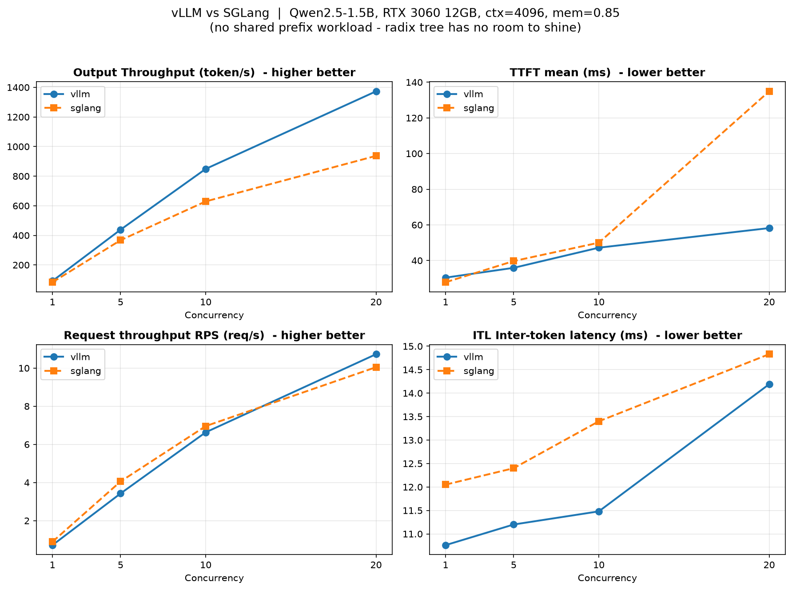

# vLLM vs SGLang 初步对比跑分

> 完成 05-04 计划。用**框架无关**的压测脚本（只依赖 OpenAI 兼容接口）在相同硬件/模型/参数下对比 vLLM 和 SGLang。
>
> ⚠️ **重要前提**：本负载**无共享前缀**（40 个不同主题），RadixAttention 的前缀复用没有发挥空间——所以这组数据是"基线流程验证"，**不是两框架的最终评判**。真正见分晓的是高复用率场景（见 [[RadixAttention多轮对话实验-06-13]]）。

---

## 实验配置（严格对齐）

| 参数 | vLLM | SGLang |
|---|---|---|
| 模型 | Qwen/Qwen2.5-1.5B | 同 |
| 上下文 | `--max-model-len 4096` | `--context-length 4096` |
| 显存 | `--gpu-memory-utilization 0.85` | `--mem-fraction-static 0.85` |
| 端口 | 8000 | 30000 |
| 环境 | 基础环境 | venv-sglang |

- **关键纪律**：一次只跑一个框架，显存独占（切换时彻底清理 EngineCore 残留）。
- 负载：40 个不同主题的请求，每个 max_tokens=128，temperature=0，stream 模式。
- 并发档：1 / 5 / 10 / 20，跑前各预热一次（不计）。
- 脚本：[09_compare_bench.py](../09_compare_bench.py)

---

## 数据（单次，今天先感受流程）

### vLLM

| 并发 | RPS | 吞吐(tok/s) | TTFT mean | ITL |
|---:|---:|---:|---:|---:|
| 1 | 0.72 | 91.6 | 30.4ms | 10.76ms |
| 5 | 3.42 | 438.4 | 35.9ms | 11.20ms |
| 10 | 6.63 | 849.1 | 47.2ms | 11.48ms |
| 20 | 10.73 | 1373.2 | 58.2ms | 14.19ms |

### SGLang

| 并发 | RPS | 吞吐(tok/s) | TTFT mean | ITL |
|---:|---:|---:|---:|---:|
| 1 | 0.89 | 83.0 | 27.8ms | 12.05ms |
| 5 | 4.05 | 367.3 | 39.7ms | 12.40ms |
| 10 | 6.96 | 629.4 | 50.0ms | 13.40ms |
| 20 | 10.05 | 937.2 | 134.9ms | 14.83ms |

### 对比图



---

## 解读（含局限声明）

### ⚠️ 第一要务：这组数据为什么不能下"谁更强"的结论

1. **本负载无共享前缀**。40 个主题各不相同，RadixAttention（SGLang 的看家本领）和 vLLM 的 APC 都**没有缓存可命中**。两框架退化成"纯生成"比拼，radix 树的价值完全没体现。
   - 真正的差距在**多轮对话 / RAG / few-shot** 这类高前缀复用场景——那里 SGLang 才会拉开（见昨天的 [[RadixAttention多轮对话实验-06-13]]：半块对齐前缀 SGLang 命中 94.9% vs vLLM 82.1%）。

2. **吞吐(tok/s)两边不可直接比**。我发现一个关键现象：RPS 和 tok/s **方向相反**——
   - 低并发时 SGLang 的 RPS 更高（请求更快完成），但 vLLM 的 tok/s 更高。
   - 原因：**同 prompt 同 temperature=0，两框架的实际生成 token 数不同**（默认采样参数、停止条件、chat template 的细微差异导致输出长短不一）。
   - 所以 **tok/s 受"生成了多长"影响，不是纯速度指标**。**RPS（每秒完成多少请求）才是这个对比里更公平的指标**。

3. **单次测量，噪声大**。计划明确：差异 <10% 在 3 次重复的噪声范围内，记为"持平"。今天只跑 1 次感受流程，正式结论要 Week 6 各跑 3 次取中位。

### 在上述前提下能说的

| 指标 | 观察 | 是否可信 |
|---|---|---|
| **RPS** | 并发 1-10 两者咬得很紧（差 5-20%，且低并发 SGLang 略高）；并发 20 vLLM 略反超 | 噪声范围内，**记为持平** |
| **TTFT** | 低并发 SGLang 略低；**并发 20 时 SGLang 飙到 135ms（vLLM 58ms）** | 这个差异较大，值得复测 |
| **ITL** | vLLM 略低（11-14ms vs 12-15ms） | 差异小，持平 |

### 唯一值得注意的信号：并发 20 的 TTFT

SGLang 在并发 20 时 TTFT mean 134.9ms、p95 253.6ms，明显高于 vLLM（58ms）。可能原因：
- SGLang 默认 `cuda_graph_max_bs=8`（昨天安装笔记记录过），并发 20 超出 CUDA graph 捕获范围，高并发要走 eager path。
- vLLM 默认捕获到更大的 batch size。

> 但这是**单次数据 + 默认参数**，不能就此断定 SGLang 高并发弱。需要复测，且可以试 SGLang 调大 `--cuda-graph-max-bs`。这正是"别下草率结论"的典型例子。

---

## 结论

> **在无共享前缀的纯生成负载下，vLLM 和 SGLang 性能基本持平**（RPS 差异在噪声范围内）。这符合预期——两者的核心优化（PagedAttention / RadixAttention）在这种负载下都用不上。**框架的真正差异要到高前缀复用场景才显现。**

这次的价值是**跑通了框架无关的对比流程**：同一脚本指向不同端口，配置严格对齐，显存独占切换。Week 6 正式跑分时直接复用。

---

## 局限与下一步

- [ ] **各跑 3 次取中位**（今天单次，噪声大）
- [ ] **加共享前缀负载**：复现多轮对话 / 固定 system prompt 场景，让 radix 树发挥（05-10 计划）
- [ ] **复测并发 20 的 TTFT 异常**，试调 SGLang `--cuda-graph-max-bs`
- [ ] tok/s 不可比 → 下次固定输出长度（`ignore_eos` + 固定 max_tokens）让生成量一致

## 今日产出

- [x] **09_compare_bench.py**（08 已被 structured_output 占用，改用 09）+ bench_vllm.csv + bench_sglang.csv
- [x] **assets/compare_v1.png**（吞吐/TTFT/RPS/ITL 四子图）
- [x] **解读笔记**（含 3 条局限声明 + 并发 20 TTFT 信号）

## 复现命令

```bash
# 轮1: vLLM (基础环境)
HF_HUB_OFFLINE=1 NO_PROXY="*" vllm serve Qwen/Qwen2.5-1.5B \
  --max-model-len 4096 --gpu-memory-utilization 0.85
NO_PROXY="*" python3 09_compare_bench.py --base-url http://127.0.0.1:8000 --tag vllm
# 清理: fuser -k 8000/tcp; ps aux|grep EngineCore|grep -v grep|awk '{print $2}'|xargs -r kill -9

# 轮2: SGLang (venv)
source ~/venv-sglang/bin/activate
NO_PROXY="*" HF_HUB_OFFLINE=1 python3 -m sglang.launch_server \
  --model-path Qwen/Qwen2.5-1.5B --context-length 4096 \
  --mem-fraction-static 0.85 --port 30000
NO_PROXY="*" python3 09_compare_bench.py --base-url http://127.0.0.1:30000 --tag sglang

# 画图 (基础环境装了 matplotlib)
/home/guoda/python/bin/python3 plot_compare.py
```
