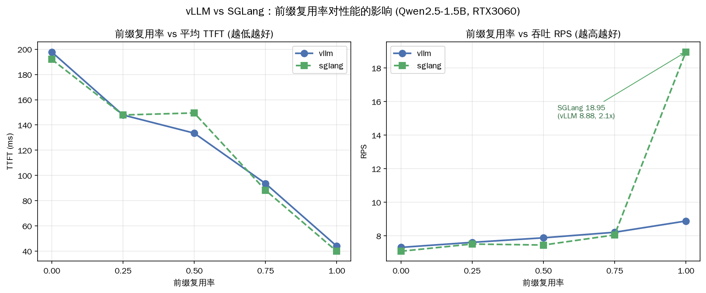

# 前缀复用率 vs 性能实验

> 这是验证"前缀复用率越高 SGLang 优势越大"假设的**受控梯度实验**——05-04 初步跑分留下的待验证假设，今天用数据定论。
>
> 变量：`prefix_ratio`（共享前缀占总输入比例）从 0% 到 100%。固定：输入~512 token、输出 64 token、20 请求、并发 8。脚本 [10_prefix_ratio_bench.py](../10_prefix_ratio_bench.py)。

环境：Qwen2.5-1.5B，RTX 3060 12GB，vLLM 0.22.1 / SGLang 0.5.13，配置严格对齐（ctx=4096, mem=0.85）。

---

## 实测数据

| 复用率 | vLLM TTFT | SGLang TTFT | vLLM RPS | SGLang RPS |
|---:|---:|---:|---:|---:|
| 0% | 197.8ms | 192.0ms | 7.31 | 7.08 |
| 25% | 147.9ms | 147.9ms | 7.61 | 7.51 |
| 50% | 133.5ms | 149.5ms | 7.88 | 7.45 |
| 75% | 93.6ms | 88.3ms | 8.21 | 8.05 |
| **100%** | **44.0ms** | **39.9ms** | **8.88** | **18.95** |



---

## 核心发现

### 1. TTFT：两框架几乎同步下降

复用率 0%→100%，两者 TTFT 都从 ~195ms 降到 ~42ms（降幅 ~78%）。曲线几乎重合——**单请求延迟维度上，两框架对前缀复用的利用相当**。这符合预期：都能命中前缀缓存跳过 prefill。

### 2. 吞吐：100% 复用率时 SGLang 暴涨 2.1 倍（最关键发现）

这是全实验最震撼的一点：
- 复用率 0%-75%：两框架 RPS 基本持平（7-8 区间）
- 复用率 **100%：SGLang RPS=18.95，vLLM 仅 8.88——SGLang 是 vLLM 的 2.1 倍**

```
RPS @ 100% 复用率:
  vLLM:   8.88  ████████▉
  SGLang: 18.95 ███████████████████  ← 2.1x!
```

> **为什么吞吐差异比 TTFT 大这么多？** TTFT 衡量"单个请求多快出第一个字"，复用让两者都快。但 RPS 衡量"系统整体每秒处理多少请求"——当所有请求共享同一长前缀（100%），SGLang 的 radix 树让这段前缀的 KV **只算一次、全局共享**，GPU 算力几乎全部释放给 decode；vLLM 的块哈希虽然也命中，但 token 级 vs 块级的粒度差 + 调度开销，让它在"满负荷共享"场景下吞吐打了对折。这正是 [[RadixAttention多轮对话实验-06-13]] 里"缓存粒度细"的吞吐放大版。

### 3. 拐点在哪：>75% 复用率后 SGLang 吞吐优势才显著

- 50% 复用率时 SGLang 反而略低（149.5ms vs 133.5ms TTFT，可能是 radix 树维护开销在中等复用下没回本）
- **真正拉开是在接近 100% 的高复用场景**

---

## 结论（带数字）

> 复用率 0% 时两框架 TTFT 分别为 **197.8ms / 192.0ms**（接近，基准差异在噪声内）；复用率 100% 时为 **44.0ms / 39.9ms**（TTFT 接近），但**吞吐 RPS 为 8.88 / 18.95——SGLang 高出 2.1 倍**。
>
> SGLang 的吞吐优势在 **75% 复用率以上**开始显著，到 100% 时达到顶峰，适合**客服 / agent / RAG / 多轮长对话**这类高复用负载；vLLM 在低复用负载下不输（甚至中等复用 TTFT 略优），且实现更简单、生态更成熟。

### 选型一句话

- **高前缀复用**（固定 system prompt、RAG、多轮）→ **SGLang**，吞吐可达 2 倍。
- **低复用 / 纯生成**（批量翻译、独立摘要）→ 两者持平，看生态熟悉度，**vLLM** 更稳妥。

---

## 今日产出

- [x] 10_prefix_ratio_bench.py（框架无关，复用率梯度 0-100%）
- [x] prefix_ratio_vllm.csv + prefix_ratio_sglang.csv
- [x] assets/prefix_ratio_comparison.png（TTFT + RPS 双图）
- [x] 结论填写完整（0% 时 198/192ms，100% 时吞吐 8.88 vs 18.95，2.1x）

## 复现

```bash
# vLLM
HF_HUB_OFFLINE=1 NO_PROXY="*" vllm serve Qwen/Qwen2.5-1.5B --max-model-len 4096 --gpu-memory-utilization 0.85
NO_PROXY="*" python3 10_prefix_ratio_bench.py --base-url http://127.0.0.1:8000 --tag vllm
# SGLang
NO_PROXY="*" HF_HUB_OFFLINE=1 python3 -m sglang.launch_server --model-path Qwen/Qwen2.5-1.5B --context-length 4096 --mem-fraction-static 0.85 --port 30000
NO_PROXY="*" python3 10_prefix_ratio_bench.py --base-url http://127.0.0.1:30000 --tag sglang
# 画图
/home/guoda/python/bin/python3 plot_prefix_ratio.py
```
