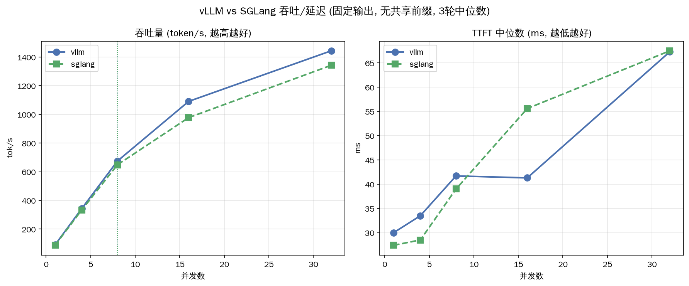

# 吞吐量对比实验（固定输出场景）

> Week 6 正式实验。场景 A（固定输入 256 + 输出 128，无共享前缀），并发 1→32，**3 轮取中位数**。脚本 [13_bench_runner.py](../13_bench_runner.py)。

环境：Qwen2.5-1.5B，RTX 3060，vLLM 0.22.1 / SGLang 0.5.13，max_model_len=4096，显存 0.85，对齐。

---

## 实测数据（3 轮中位数）

| 并发 | vLLM tok/s | SGLang tok/s | vLLM RPS | SGLang RPS | vLLM TTFT | SGLang TTFT |
|---:|---:|---:|---:|---:|---:|---:|
| 1 | 90.2 | 87.1 | 0.70 | 0.68 | 30ms | 28ms |
| 4 | 343 | 334 | 2.68 | 2.61 | 33ms | 29ms |
| 8 | 675 | 636 | 5.28 | 4.97 | 40ms | 41ms |
| 16 | 1093 | 965 | 8.54 | 7.54 | 43ms | 54ms |
| **32** | **1443** | **1342** | 11.27 | 10.49 | 67ms | 67ms |

3 轮一致性极好（vLLM 并发32: 1440/1443/1444，SGLang: 1339/1345/1342）。

---

## 核心发现

### 1. 无共享前缀场景：vLLM 略快（~7%）

并发 32 时 vLLM 1443 vs SGLang 1342 tok/s，**vLLM 快约 7.5%**。全程 vLLM 略领先。这与 [[前缀复用率实验-06-14]] 的发现一致：**无前缀复用时两者接近，vLLM 在纯生成上略优**（可能与 async scheduling、CUDA graph 调度细节有关）。

> 对比记忆：05-10 前缀实验里 **100% 复用率时 SGLang 反超 2.1x**。今天**无复用**，vLLM 略胜。两个数据点共同勾勒：**复用率是分水岭**。

### 2. 吞吐拐点：并发 8-16 开始饱和

并发翻倍时的吞吐增长比：

| 并发翻倍 | vLLM | SGLang |
|---|---:|---:|
| 1→4 | 3.80x | 3.83x |
| 4→8 | 1.97x | 1.94x |
| 8→16 | 1.62x | 1.51x |
| 16→32 | 1.32x | 1.37x |

> **拐点物理含义**：
> - 1→4：增长接近理想（并发×4 → 吞吐×3.8），GPU 算力还没喂饱，新请求能"同时处理"。
> - 8→16、16→32：增长降到 1.3-1.6x（远低于并发的 2x），**GPU 接近饱和**，新请求开始排队，TTFT 上升。
> - **拐点在并发 8-16 之间**——这就是 RTX 3060 + 1.5B 的吞吐甜点区。超过后加并发只增延迟不增吞吐。

### 3. 两框架拐点位置相同

vLLM 和 SGLang 的饱和曲线几乎重合——说明**无共享前缀时，两者的调度/内存效率相当**，差异（7%）在工程实现细节，不是架构性的。

---

## 今日产出

- [x] run 3 轮 + merge_results.py（3 轮中位数）
- [x] bench_results/{vllm,sglang}_fixed_output.csv（3 轮中位数）
- [x] assets/throughput_v1.png（含拐点）
- [x] 拐点笔记（并发 8-16 饱和，物理含义）

## 一句话

> **无共享前缀的固定输出场景，vLLM 略快 7%（1443 vs 1342 tok/s @并发32），两框架吞吐拐点都在并发 8-16。** 这与"复用率决定选型"一致——无复用时 vLLM 略优，高复用时 SGLang 反超 2.1x（05-10）。拐点之后加并发只增延迟不增吞吐。
