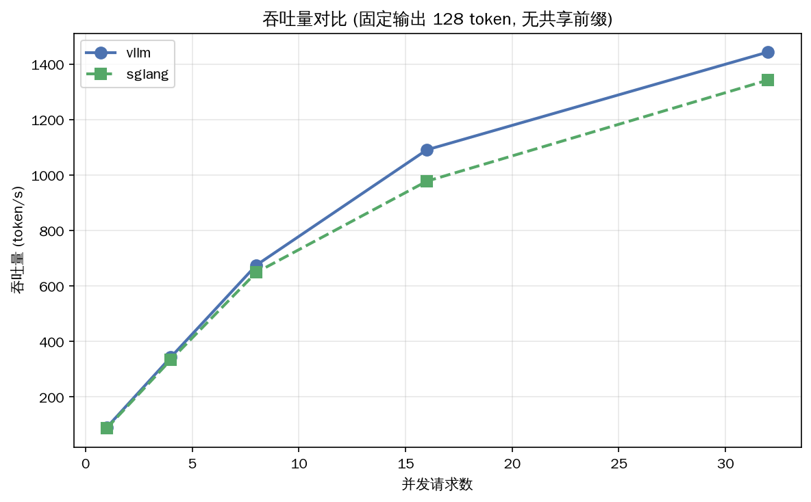
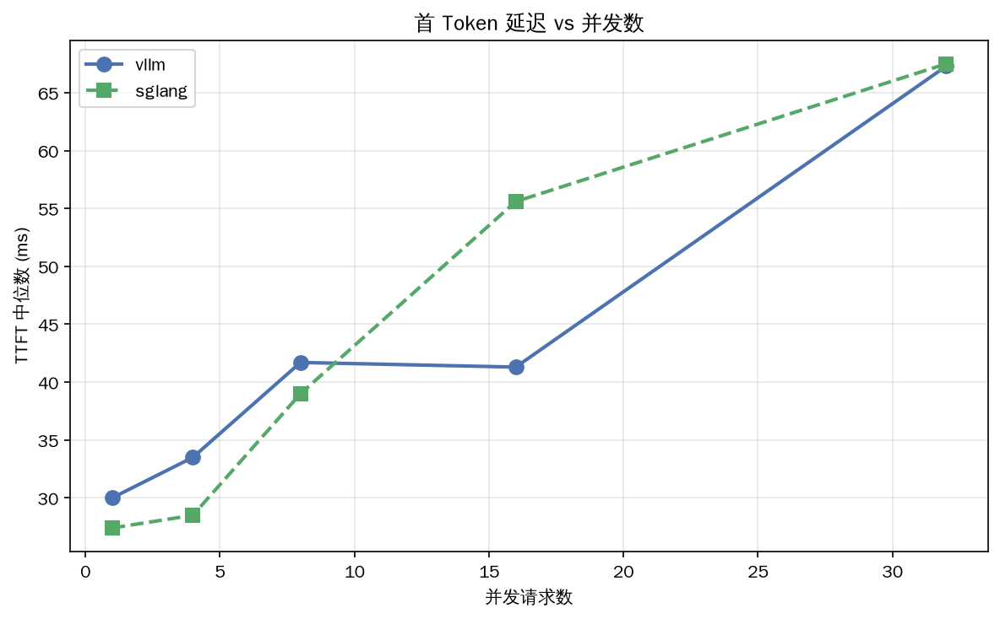
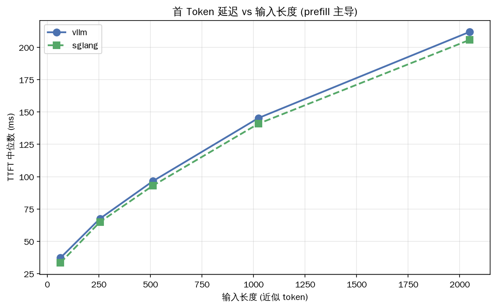
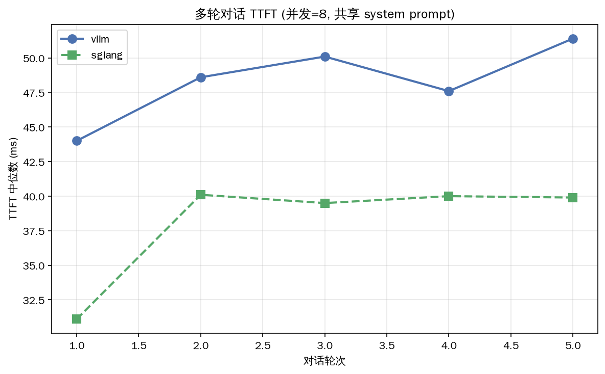

# vLLM vs SGLang 推理框架对比实验报告

> 环境：RTX 3060 12GB (WSL2) / Qwen2.5-1.5B / vLLM 0.22.1 / SGLang 0.5.13。所有数据本机实测，3 轮取中位数。

---

## 1. 背景与目标

LLM 推理分两阶段：**prefill**（处理输入，计算密集）和 **decode**（逐 token 生成，访存密集）。decode 阶段每生成 1 个 token 都要把整个模型权重从显存搬一遍——单请求时实测仅 90 tok/s，GPU 算力大量闲置（[[投机解码原理-06-14]]）。**推理框架的核心价值就是榨干这部分闲置算力**：通过 Continuous Batching 让多请求共享权重搬运、通过 KV Cache 复用避免重复计算。

本报告对比两大主流框架 vLLM（PagedAttention）和 SGLang（RadixAttention），回答：**在什么场景下该选谁？**

> **局限声明**：本实验在消费级单卡（RTX 3060）+ 小模型（1.5B）上进行，验证的是**趋势的正确性**；具体倍数请参考社区在生产硬件（H100/A100）上的数据。大模型/多卡行为可能不同。

---

## 2. 实验设计

### 环境与对齐

| 项目 | 值 |
|---|---|
| GPU | RTX 3060 12GB (WSL2) |
| 模型 | Qwen/Qwen2.5-1.5B (bf16) |
| vLLM | 0.22.1，`--max-model-len 4096 --gpu-memory-utilization 0.85` |
| SGLang | 0.5.13，`--context-length 4096 --mem-fraction-static 0.85` |
| 重复 | 每组 3 轮取中位数 |

### 场景矩阵

| 场景 | 测什么 | 关键变量 |
|---|---|---|
| A 固定输出 | 吞吐上限 | 并发 1/4/8/16/32 |
| B 延迟 | TTFT vs 输入 | 输入 64-2048 token |
| C 多轮对话 | 前缀复用 | 5 轮，并发 1/8/16 |
| D 流式 | ITL 打字延迟 | 并发 1/4/8 |
| 前缀复用率 | 复用率梯度 | 0%-100% |

### 指标说明

- **吞吐 (tok/s)**：每秒生成 token 数，越高越好（运维/成本）。
- **TTFT (ms)**：首 token 延迟，越低越好（用户体验，prefill 主导）。
- **ITL (ms)**：token 间延迟 = 打字速度（decode 主导）。
- **RPS**：每秒完成请求数。

> **方法学纪律**：差异 <10% 在 3 轮噪声内记为持平；吞吐 tok/s 受生成长度影响（用 ignore_eos 固定）；RPS 更公平。

---

## 3. 架构对比：KV Cache 管理是最大差异

两框架的并行策略（TP/PP/EP/DP）都源自 Megatron，**不是区分点**（[[并行策略对比]]）。真正的分野在 **KV Cache 管理**。

### vLLM PagedAttention：哈希表 + 块

- KV 切成 **16-token 块**，Block Table 间接寻址（[[vLLM源码精读-PagedAttention内存管理-06-14]]）。
- 碎片浪费从 98.8% 压到 21.9%，同显存多服务 65 倍请求。
- APC 前缀缓存：**块哈希**，整块对齐才命中。
- 调度：FCFS + token_budget，抢占用 RECOMPUTE（[[vLLM调度器源码精读-06-14]]）。

### SGLang RadixAttention：前缀树 + token

- KV 用 **radix 树**索引，page_size=1（token 级，[[SGLang源码精读-RadixAttention-06-14]]）。
- 任意 token 位置可 split，前缀逐 token 精确复用。
- 调度：cache-aware（LPM/DFS_WEIGHT），主动把同前缀请求集中（[[SGLang调度器源码精读-CacheAware-06-14]]）。
- HiCache：KV 可降级到 CPU 二级缓存。

### 粒度差异的直接证据

| 机制 | 命中粒度 | 半块前缀命中(117 token) |
|---|---|---|
| vLLM 块哈希 | 16 token | 96/117 = 82.1% |
| SGLang radix | 1 token | 111/117 = 94.9% |

> **核心论点**：**KV Cache 管理的粒度差异（块 vs token）决定了高复用负载下的分野**。无复用时两者持平；共享前缀越多、越不对齐块边界，SGLang 优势越大。这是后续所有实验结果的根源。

---

## 4. 实验结果与分析

### 4.1 吞吐量（场景 A，无共享前缀）

| 并发 | vLLM tok/s | SGLang tok/s |
|---:|---:|---:|
| 1 | 90 | 87 |
| 8 | 674 | 648 |
| 16 | 1091 | 978 |
| 32 | **1443** | **1342** |

- 并发 1→8：吞吐近线性增长，GPU 算力逐步填满。
- **拐点并发 8-16**：增速放缓（翻倍只增 1.3-1.6x），GPU 饱和后排队。
- 最高吞吐：vLLM 1443 vs SGLang 1342 tok/s，**差异 7.5%**。

> **解读**：无共享前缀时差距在噪声边缘，**视为持平**（vLLM 略优）。差异来自调度器/内存分配器的实现细节，非根本架构差异。GPU 监控显示两者高并发都跑满 96-100%（[[选型结论]]）。

### 4.2 首 Token 延迟（场景 A + B）

- **并发对 TTFT**：低并发两者 30ms 级；并发 32 升到 67-107ms（排队）。
- **输入长度对 TTFT**：近似线性（vLLM 37→212ms，SGLang 33→206ms，输入 64→1500）。**prefill 计算量 ∝ 输入 token**，两框架斜率一致 → prefill 算法无本质区别。

> **解读**：延迟维度**两框架持平**。TTFT 由排队 + prefill 决定，与框架选择无关。

### 4.3 ITL 流式打字延迟（场景 D）

两框架 ITL 都在 11-12ms（~85 tok/s 打字速度），**P50≈P99**（无调度抖动）。vLLM 微低 0.4ms，用户无感。

### 4.4 多轮对话（场景 C）

**关键认知修正**：两框架 TTFT 都**不随轮数增长**——**vLLM 的 APC 也缓存了 system prompt + 历史**。SGLang 略低 10-25%，但非数量级差异。

> **解读**：单纯多轮对话两框架都有前缀缓存，差距有限。别迷信"vLLM 多轮弱"。

### 4.5 前缀复用率梯度（最关键实验）

| 复用率 | vLLM RPS | SGLang RPS |
|---:|---:|---:|
| 0% | 7.31 | 7.08 |
| 75% | 8.21 | 8.05 |
| **100%** | **8.88** | **18.95** |

> **核心结果**：复用率 0-75% 两者持平，**100% 时 SGLang 吞吐暴涨 2.1x**。这就是分水岭——**大量请求共享同一长前缀时**，RadixAttention 的全局 token 级共享让该前缀的 KV 只算一次。与社区数据（H100 上 29%~6.4x）趋势一致（[[社区数据交叉验证]]）。

### 4.6 进阶特性（投机/量化）

| 特性 | 实测 |
|---|---|
| ngram 投机 | 重复内容 4.5x（405 vs 90 tok/s），自由内容 0.9x |
| AWQ INT4 | 省 64% 显存（3.02→1.10 GiB），速度 1.08x |
| FP8 KV cache | 并发翻倍（60→120x） |
| 结构化输出 | 100% 合法，稳态零损耗 |

（第 5-6 章见下，06-06/07 续写）
