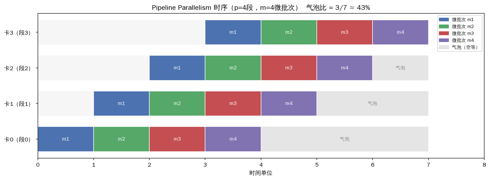
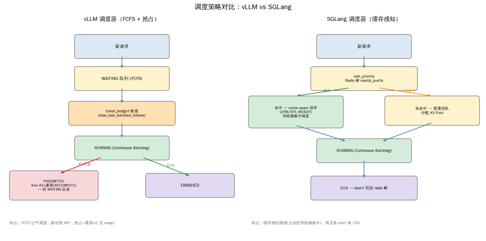
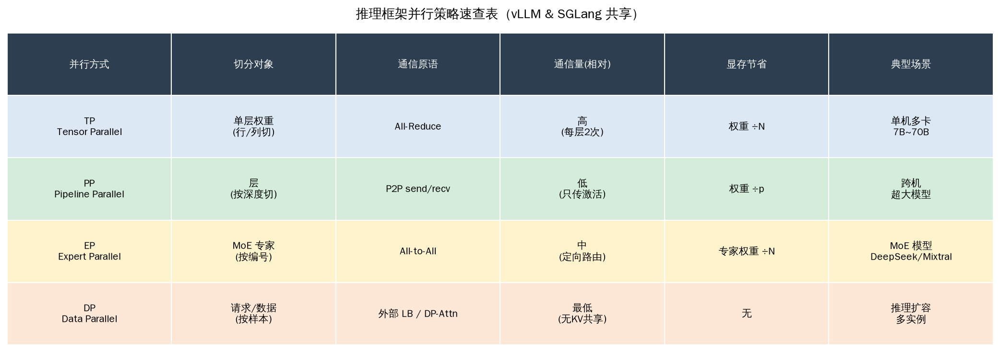
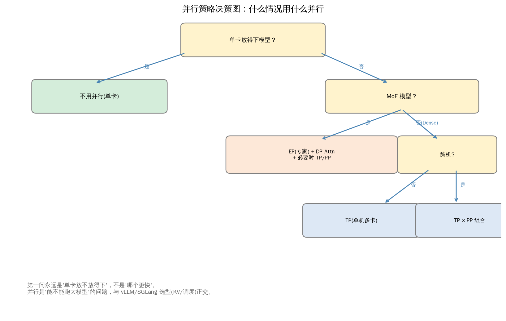

# 并行策略四维对比（Week 4 总结）

> 单卡（RTX 3060）无法实跑多卡，但通过源码 + 数学推导 + 社区数据，搞懂了四种并行的本质。本篇是 Week 4 的汇总。

---

## Pipeline Parallelism 与气泡问题

PP = 把 Transformer 层按深度切到多卡（卡0 算 1~N 层，卡1 算 N+1~2N 层…）。

### 气泡问题

单 batch 时，卡1 要等卡0 算完才能开始，形成"空等"。解决方案：**micro-batch 流水线化**。



**气泡比公式**：`(p-1)/(m+p-1)`，p=流水线段数，m=微批次数。

| p | m | 气泡比 |
|---|---|---|
| 4 | 4 | 3/7 = 43% |
| 4 | 8 | 3/11 = 27% |
| 4 | 16 | 3/19 = 16% |

> **微批次越多，气泡越小，但内存越大**（要同时存 m 个微批次的激活值）。这是 PP 调优的核心权衡。虚拟流水线（vPP，每段再细分 chunk）能进一步压气泡。

### PP 源码要点（vLLM + SGLang）

- **层分配**：`num_hidden_layers // pp_size`，余数给前几段。
- **stage 间通信**：卡 i 把最后一层隐状态 `send` 给卡 i+1（`torch.distributed.send/recv`，**点对点 P2P**，不是广播）。
- 两框架 PP 实现基本一致（Megatron 范式），差异在 vPP 支持程度。
- vLLM PP 入口：`vllm/distributed/parallel_state.py`。

---

## 并行策略四维速查表

| 并行 | 切分对象 | 通信原语 | 通信量 | 显存减少 | 适用 |
|---|---|---|---|---|---|
| **TP** | 单层权重（行/列） | All-Reduce | ∝ batch×hidden | 1/N | 单机多卡，延迟敏感 |
| **PP** | 层（按深度） | P2P send/recv | ∝ micro_batch×hidden | 1/p（权重） | 跨机，超大模型 |
| **EP** | MoE 专家 | All-to-All | ∝ tokens×hidden×激活率 | 1/N（专家权重） | MoE 模型 |
| **DP** | 数据（请求级） | All-Reduce（训练梯度） | 推理时无 | 不减少 | 推理靠外部 LB / SGLang DP Attn |

### 通信原语对比

```
TP All-Reduce:  每卡都要完整结果 (广播求和)        — 量大但单机 NVLink 扛得住
PP P2P:         只传相邻 stage 的激活 (点对点)      — 量小, 跨机可接受
EP All-to-All:  token 定向去激活专家所在卡 (路由)   — MoE 稀疏激活省通信
DP:             复制模型处理不同请求 (推理不通信)    — 简单, 但不省显存
```

---

## 组合使用（真实部署）

| 场景 | 并行组合 |
|---|---|
| Llama-7B，单机 8 卡 | TP=8（最常见） |
| Llama-70B，2 机 16 卡 | TP=8 + PP=2 |
| DeepSeek-V3，多机 | TP + EP=64 + PP（按需） |
| SGLang 大 MoE 推理 | EP=N + DP Attention |

---

## 单卡实验的局限与外推

- **本实验（RTX 3060 单卡）无法直接实测 TP/PP/EP**——结论来自源码 + 数学推导 + 社区 benchmark。
- ✅ **可外推**（与硬件无关的数学）：通信量公式、气泡比公式 `(p-1)/(m+p-1)`、TP 数学无损（验证误差 1e-6）。
- ⚠️ **不可外推**：绝对延迟、最优 TP 数（依赖 NVLink 带宽 vs 计算比）。

---

## 自测：为什么单机内用 TP，跨机用 PP？

> **答**：
> - 单机 NVLink ~600 GB/s，All-Reduce 延迟 <0.1ms，TP 的高频全量通信可接受。
> - 跨机 InfiniBand ~200 GB/s，延迟高 10-100 倍，TP 的 All-Reduce 会成瓶颈。
> - PP 的 P2P 通信量小（只传 micro_batch 的激活，不传权重），跨机也扛得住。
> - 所以经验法则：**TP 限在单节点内（≤8 卡，靠 NVLink），跨节点用 PP**。MoE 再叠 EP。

---

## 今日产出

- [x] assets/pp_schedule.png（PP 时序甘特图，气泡可视化）
- [x] 气泡比公式手算（p=4: m=4→43%, m=8→27%, m=16→16%）
- [x] 并行策略对比.md（四维表 + 组合场景 + 外推边界）

## Week 4 一句话

> **TP 切权重(单机)、PP 切层(跨机)、EP 分专家(MoE)、DP 复制(扩展)。** 四者正交，可组合。它们都是 vLLM/SGLang 共享的 Megatron 底座，**不是两框架的差异点**——差异在 KV Cache 管理(M2/M3)和调度策略(05-13/14)。并行是"能不能跑大模型"，KV/调度是"跑得好不好"。

---

## PPT 素材三图（05-18）

### 图1：调度策略对比 `assets/scheduler_compare.png`

> **Takeaway**：SGLang 的缓存感知调度（主动把同前缀请求集中）是它在高复用负载下 TTFT 更低的**调度层**原因；vLLM 是公平 FCFS + 被动查 APC，抢占用重算。

### 图2：并行策略速查表 `assets/parallelism_table.png`

> **Takeaway**：TP/PP/EP/DP **不互斥**，大模型推理通常组合使用（如 DeepSeek-V3 = TP+EP+PP）。它们是两框架共享的底座。

### 图3：并行决策图 `assets/parallelism_decision.png`

> **Takeaway**：选并行策略的**第一问是"单卡放不放得下"**，不是"哪个更快"。并行解决"能跑"，框架选型(KV/调度)解决"跑得好"。
