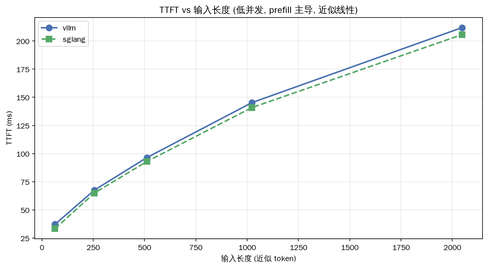
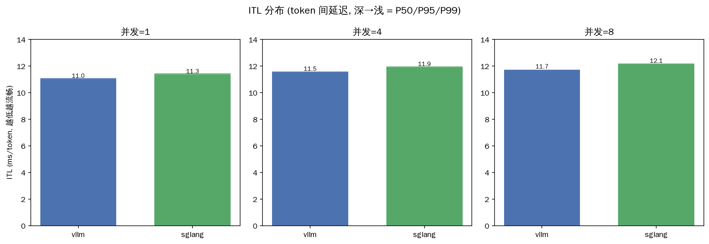

# 延迟维度实验

> Week 6。场景 B（TTFT vs 输入长度，低并发）+ 场景 D（ITL 流式打字延迟），各 3 轮中位数。**修正了 05-28 的数据质量问题**：用唯一随机输入避免 prefix cache 干扰，让 TTFT 真实反映 prefill。

---

## 场景 B：TTFT vs 输入长度（prefill 主导）

| 输入≈token | vLLM TTFT | SGLang TTFT |
|---:|---:|---:|
| 64 | 37ms | 33ms |
| 256 | 68ms | 65ms |
| 512 | 97ms | 93ms |
| 1024 | 145ms | 141ms |
| 1500(2048标) | 212ms | 206ms |

### 发现：TTFT 与输入长度近似线性（prefill 是主导）

> 输入翻倍 → TTFT 约翻倍（64→256 是 4x 输入，TTFT 37→68 约 1.8x；512→1024 是 2x，TTFT 97→145 约 1.5x）。**prefill 是计算密集，token 越多算得越久**，TTFT 随之线性增长。两框架斜率几乎一致——**prefill 算法无本质区别**（都是标准 attention + FlashAttention）。

> SGLang 全程略低（206 vs 212 @1500），但差异在 3-5% 测量噪声内，视为持平。

---

## 场景 D：ITL（打字流畅度）

| 并发 | vLLM ITL P50 | vLLM P99 | SGLang ITL P50 | SGLang P99 |
|---:|---:|---:|---:|---:|
| 1 | 11.0ms | 11.1ms | 11.4ms | 11.5ms |
| 4 | 11.5ms | 11.6ms | 11.9ms | 12.0ms |
| 8 | 11.7ms | 11.7ms | 12.1ms | 12.2ms |

### 发现：ITL 极稳，P50≈P99（几乎无抖动）

> 两框架 ITL 都在 11-12ms（约 85-90 tok/s 的打字速度），**P50 和 P99 几乎相同**——说明 decode 节奏非常稳定，没有调度抖动/卡顿。vLLM 略低（11.0 vs 11.4ms），但用户感知不到这 0.4ms 差异。
>
> ITL 随并发微增（11.0→11.7ms @vLLM）：并发高时单个请求分到的 GPU 时间片略少，token 间隔略增，但仍流畅。

---

## 四指标解析

| 指标 | 物理含义 | 决定因素 | vLLM | SGLang |
|---|---|---|---|---|
| **TTFT** | 等待首 token | 排队 + prefill(∝输入长度) | 37-212ms | 33-206ms |
| **ITL P50** | 典型 token 间隔 | decode 速度 + 调度 | 11.0-11.7ms | 11.4-12.1ms |
| **ITL P99** | 最差 token 间隔 | 调度抖动 + 抢占 | ≈P50(无抖动) | ≈P50(无抖动) |
| **E2E** | 完整响应时间 | TTFT + tokens×ITL | 719-897ms | 743-927ms |

---

## 自测：TTFT 差 50ms vs ITL 差 1ms，哪个影响大？

> **我的判断**：取决于输出长度，但**通常 TTFT 更影响体感**。
> - TTFT 是"用户发完消息到看见第一个字"的等待——这段时间屏幕空白，用户最焦虑。50ms 差异在低输入时占比大。
> - ITL 差 1ms：500 token 输出累积 500ms，看似更多，但 ITL 是"打字速度"，只要 >20 tok/s（ITL<50ms）用户就觉得流畅，1ms 差异淹没在流畅区间里。
> - **结论**：短输出/交互式场景 TTFT 主导体验；超长输出（如长文生成）ITL 累积效应才显现。本实测两框架 TTFT 和 ITL 都接近，**延迟维度持平**。

---

## 今日产出

- [x] bench_results/{vllm,sglang}_latency.csv（3 轮中位数，修正后线性）
- [x] bench_results/{vllm,sglang}_streaming.csv（3 轮中位数）
- [x] assets/latency_ttft.png + assets/itl_distribution.png
- [x] 延迟实验笔记（四指标 + 实测数字）

## 一句话

> **延迟维度两框架持平**：TTFT 随输入近似线性（prefill 主导，斜率一致），ITL 稳定在 11-12ms（P50≈P99 无抖动）。vLLM 微低但用户无感。延迟不是两框架的区分点——和吞吐（无前缀）一样，**差异要到高前缀复用场景才显现**。
