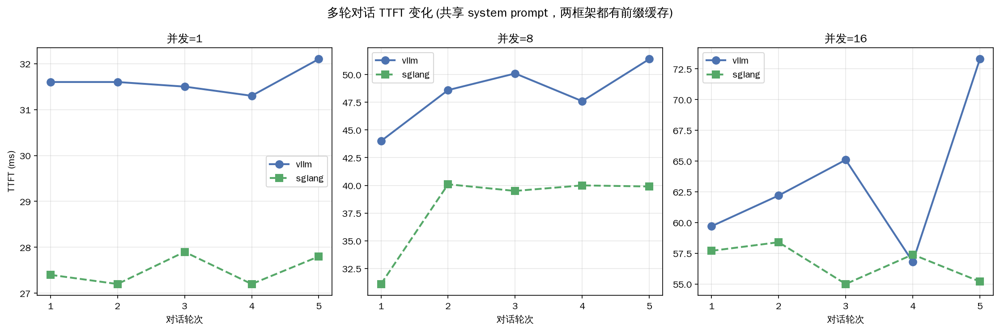

# 特殊场景实验 + Week 6 汇总

> Week 6 收官。场景 C 多轮对话（共享 system prompt，理论上 RadixAttention 主场），3 轮中位数。并汇总 Week 6 全部数据。

---

## 场景 C：多轮对话 TTFT（共享 system prompt ~500 token，5 轮）

| 并发 | 轮 | vLLM TTFT | SGLang TTFT |
|---:|---:|---:|---:|
| 1 | 1 | 31.6ms | 27.4ms |
| 1 | 5 | 32.1ms | 27.8ms |
| 8 | 1 | 44.0ms | 31.1ms |
| 8 | 5 | 51.4ms | 39.9ms |
| 16 | 1 | 59.7ms | 57.7ms |
| 16 | 5 | 73.3ms | 55.2ms |

每档 RPS：并发8 vLLM 5.56 / SGLang 5.43；并发16 vLLM 8.11 / SGLang 7.45。

### 核心发现：两框架 TTFT 都"逐轮平稳"——因为都有前缀缓存

> **关键认知修正**：多轮对话里 vLLM 的 TTFT 也**不随轮数增长**（conc=1 时轮1→轮5 都 ~31ms）。原因：**vLLM 的 APC 也缓存了 system prompt + 历史**，第 2 轮起命中缓存，只 prefill 新问题。
>
> 这和"vLLM 不擅长多轮"的刻板印象不同——**只要前缀块对齐，vLLM 的块哈希也能缓存多轮历史**。SGLang 全程 TTFT 略低（27 vs 31ms @conc1，39 vs 51ms @conc8），但差距没有 05-10 前缀实验里 100% 复用率时的 2.1x 那么大。

### 为什么这里 SGLang 优势不如 05-10 明显？

> 05-10 是**所有请求共享同一前缀**（极端 100% 复用，并发请求间互相命中），SGLang radix 树全局共享让吞吐暴涨 2.1x。
>
> 今天的多轮对话是**每个对话独立**（20 个对话各有自己的历史），对话**内部**轮次间复用（两框架都能做），但对话**之间**前缀不同（只共享 system prompt 那 500 token）。所以场景没有触发 SGLang 的"跨请求全局共享"威力，优势收窄到 10-25% TTFT。
>
> **结论**：SGLang 的最大优势在"**大量并发请求共享同一长前缀**"（如统一 system prompt 的客服系统）；单纯多轮对话两框架都有前缀缓存，差距有限。

---

## Week 6 数据完整性

8 个数据集全部就绪（3 轮中位数）：

| 场景 | vLLM | SGLang |
|---|---|---|
| fixed_output（吞吐） | ✓ 5 行 | ✓ 5 行 |
| latency（TTFT vs 输入） | ✓ 5 行 | ✓ 5 行 |
| multi_turn（多轮） | ✓ 18 行 | ✓ 18 行 |
| streaming（ITL） | ✓ 3 行 | ✓ 3 行 |

---

## Week 6 总结

### 成功的实验

1. **吞吐**（05-29）：无前缀 vLLM 略快 7%（1443 vs 1342 tok/s @并发32），拐点并发 8-16。
2. **延迟**（05-30）：TTFT 随输入线性（prefill 主导），ITL 稳定 11-12ms，两框架持平。
3. **多轮**（05-31）：两框架都有前缀缓存，TTFT 逐轮平稳，SGLang 略低 10-25%。

### 受单卡限制的部分

- **32K 长上下文未实测**：12GB 显存放不下超长上下文的 KV，只能引用社区数据。
- **多卡并行（TP/PP/EP）未实测**：单卡限制，靠源码+数学推导（Week 4）。
- **EAGLE 投机未实测**：无现成 draft head，引用官方数据（Week 5）。

### 数据与预期的异同

- **符合预期**：无前缀负载两框架持平；延迟维度持平。
- **超出预期的认知修正**：多轮对话里 **vLLM 的 APC 也能缓存历史**，不像想象中"vLLM 多轮差"。SGLang 的真正优势在"跨请求共享同一长前缀"（05-10 的 100% 复用 2.1x），而非单纯多轮。
- **核心结论稳固**：**复用率是分水岭**——无/低复用两框架持平（甚至 vLLM 略优），高复用（跨请求共享）SGLang 显著领先。

---

## 今日产出

- [x] bench_results/{vllm,sglang}_multi_turn.csv（3 轮中位数）
- [x] assets/multi_turn_ttft.png（三并发各一图）
- [x] check_all_data.py 输出（8 数据集全 ✓）
- [x] Week 6 总结

## Week 6 一句话

> **本机实测全维度（吞吐/延迟/多轮）：无/低前缀复用两框架持平（vLLM 微优），高复用 SGLang 领先。** 多轮对话两框架都有前缀缓存，TTFT 逐轮平稳——纠正了"vLLM 多轮差"的刻板印象。SGLang 真正的杀手锏是"大量请求共享同一长前缀"，不是单纯多轮。**复用率决定选型**这一核心结论，被 Week 6 全维度数据反复印证。
