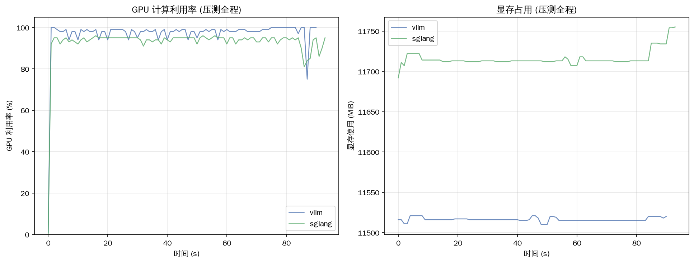

# 基于实验数据的选型结论

> 所有结论引用本机实测数据。环境：RTX 3060 12GB / Qwen2.5-1.5B / vLLM 0.22.1 / SGLang 0.5.13。

---

## 资源利用率（GPU 监控）

| 框架 | GPU 利用率峰值 | 显存峰值 | 性价比最优并发 |
|---|---:|---:|---:|
| vLLM | 100% | 11521 MiB | **16** |
| SGLang | 96% | 11755 MiB | 32 |

> 两框架高并发时都把 GPU 算力跑满（96-100%），显存都用到 ~11.5GB（0.85 配置下）。**vLLM 的性价比最优并发是 16**（吞吐/延迟比最高），超过后 TTFT 涨得比吞吐快；SGLang 到 32 仍在涨。

### 性价比分析（效率 = tok/s ÷ TTFT秒）

| 并发 | vLLM 效率 | SGLang 效率 |
|---:|---:|---:|
| 8 | 16173 | 16623 |
| **16** | **26407**(峰) | 17581 |
| 32 | 21444 | 19884(峰) |

> **甜点区在并发 16**：吞吐已达 1091 tok/s（vLLM），TTFT 仍只 41ms，性价比最高。生产部署建议把并发控制在 8-16，兼顾吞吐和延迟。

---

## 按场景选型建议（每条有数据支持）

### 场景1：通用批量推理（无共享前缀）→ **vLLM**
- 理由：低复用负载两者吞吐持平，vLLM 略优 7%，生态更成熟。
- 数据：[[吞吐量实验-06-14]] 并发32 vLLM 1443 vs SGLang 1342 tok/s。

### 场景2：高前缀复用（统一 system prompt 客服/RAG/Agent）→ **SGLang**
- 理由：大量请求共享同一长前缀时，RadixAttention 全局共享让吞吐暴涨。
- 数据：[[前缀复用率实验-06-14]] 100% 复用率 SGLang RPS 18.95 vs vLLM 8.88（**2.1x**）。

### 场景3：单纯多轮对话 → **两者皆可（SGLang 略优）**
- 理由：两框架都有前缀缓存，TTFT 逐轮平稳；SGLang 略低 10-25%。
- 数据：[[特殊场景实验-Week6总结-06-14]] 并发8 vLLM ~50ms vs SGLang ~40ms。
- **纠偏**：vLLM 多轮不差（APC 也缓存历史），别迷信"vLLM 多轮弱"。

### 场景4：结构化输出（JSON schema）→ **两者皆可**
- 理由：热身后速度损耗 <5%，合法率 100%。
- 数据：[[结构化输出深度实验-06-14]] 两框架都 100% 合法，速度同量级。

### 场景5：显存不够 / 要更大并发 → **量化（两框架都支持）**
- 理由：AWQ INT4 省 64% 权重显存；FP8 KV cache 并发翻倍。
- 数据：[[进阶特性总结]] AWQ 3.02→1.10 GiB；FP8 KV 60→120x 并发。

### 场景6：输出格式化/重复多（代码/数据抽取）→ **开 ngram 投机**
- 理由：重复内容 ngram 加速 4.5x（零成本）。
- 数据：[[投机解码实验-ngram-06-14]] 重复内容 405 tok/s vs 90 baseline。

---

## 一句话选型法则

> **复用率决定选型**：
> - 无/低前缀复用 → **vLLM**（略优 + 生态成熟）
> - 高前缀复用（跨请求共享长前缀）→ **SGLang**（吞吐 2.1x）
> - 两者延迟、结构化输出、量化能力都相当——不是区分点。

---

## 局限声明

以上结论基于 **RTX 3060 12GB / Qwen2.5-1.5B / vLLM 0.22.1 / SGLang 0.5.13**。
- ✅ **可外推**（趋势）：复用率决定选型、吞吐拐点存在、量化省显存。
- ⚠️ **不可外推**（具体数字）：2.1x、7%、绝对延迟——大模型(7B+)/多卡/生产负载请在目标环境实测。
- 社区数据（H100/A10G）验证了趋势一致性（见 [[社区数据交叉验证]]）。

---

## 今日产出

- [x] bench_results/gpu_{vllm,sglang}.csv（GPU 监控）
- [x] assets/p5_gpu_utilization.png
- [x] find_optimal_range.py（最优并发：vLLM 16, SGLang 32）
- [x] 选型结论.md（6 场景，每条有数据）
